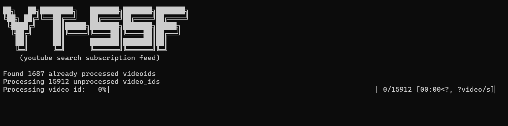

### YT-SSF
                    
yt-ssf (youtube Search Subscription Feed) can be used to search through your subscription feed for specific keyword.
it uses yt-dlp to extract all the video_ids from your `https://youtube.com/subscription/feed`. but since your subscription feed is private to you, you need to pass yt cookie to get all the video ids in your subscription feed. after retrieving the video ids, you can extract the videos id info with or without cookie. 
- without cookie, 300 videos info can be extracted / hour. (ie yt sees you as a guest user)
- with cookie, 2000 videos info can be extracted / hour.

## Why extract the video info?
By extracting the video info such as : title, description, uploader(channel name) along with the video id , We can build a lighting fast searchable self hosted database via meilisearch. 
We store the results to a ndjson or jsonlines file, as it is easier to validate and requires less computation.

## Steps:

1. Go to extension web store in whatever browser you are using youtube in. 
2. Search for `Get cookies.txt LOCALLY` extension and install it.

 

3. Go to `youtube.com` and click on the `Get cookies.txt LOCALLY` extension


4. click `export` button to export the yt cookie in netscape format. (Keep in mind, so share this netscape format cookie to anyone. or else they could use your yt account until unless you explicitly logged out and the cookie expires.)
5. Save the cookie as `youtube-netscape-cookie.txt` or whatever you prefer and place it in the `extraction-code/input` directory.
6. replace the filename in `extraction-code/extract-videoids.py` with what you saved your cookie file as.
```code
COOKIE_FILEPATH ="./input/youtube-netscape-cookie.txt"
```
7. run `python3 extraction-code/extract-videoids.py`, which will extract all the video ids in your subscription feed and stores it in `extracted-code/input/subs_feed_video_ids.txt`
8. run `python3 extraction-code/extract-info.py`, which will extract all the info of the video ids so that we can build a searchable database with it.
9. setup meilisearch with the resulting jsonl dataset and 
```
# Launch Meilisearch
./meilisearch --master-key="barryallen@16"
```
replace `barryallen@16` with your preferred masterkey .
```
cd extraction-code\output
curl ^
  -X POST 'MEILISEARCH_URL/indexes/movies/documents?primaryKey=id' ^
  -H 'Content-Type: application/x-ndjson' ^
  -H 'Authorization: Bearer barryallen@16' ^
  --data-binary @extract.json
```
next
```
curl ^
  -X GET "MEILISEARCH_URL/tasks/0" ^
  -H "Authorization: Bearer barryallen@16"
```
replace the meilisearch url enpoint in the index.html. then host the website and search for what you need in subscription feed at lighting speed.
