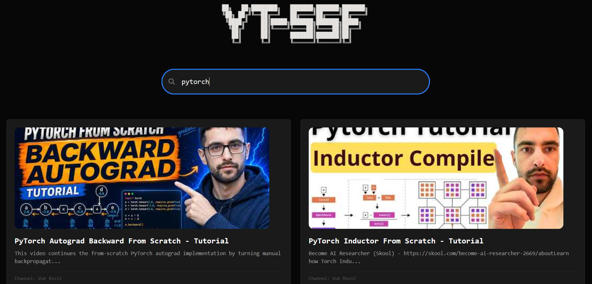
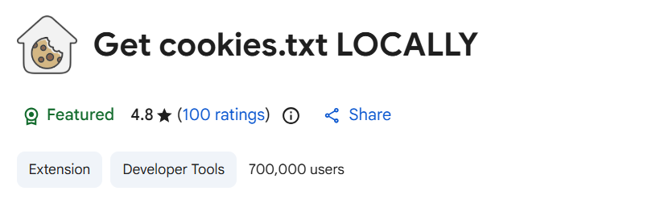
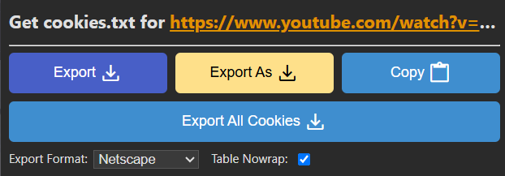

### YT-SSF
                   
yt-ssf (youtube Search Subscription Feed) can be used to search through your subscription feed for specific keyword.
it uses yt-dlp to extract all the video_ids from your `https://youtube.com/subscription/feed`. but since your subscription feed is private to you, you need to pass yt cookie to get all the video ids in your subscription feed. after retrieving the video ids, you can extract the videos id info (such as title, description, channel name, thumbnail_url) using `scrapy` library

## Why extract the video info?
By extracting the video info such as : title, description, channel name, thumbnail_url along with the video id , We can build a lighting fast searchable self hosted database via meilisearch. 
We store the results to a ndjson or jsonlines file, as it is easier to validate and requires less computation.

## Quickstart
1. download and install `yt-dlp` specific to your platform from [github](https://github.com/yt-dlp/yt-dlp#installation)
2. After installing, run 
```bash
git clone https://github.com/barryallen16/yt-ssf
cd yt-ssf
```
3. Go to extension web store in whatever browser you are using youtube in. 
4. Search for `Get cookies.txt LOCALLY` extension and install it.

 

5. Go to `youtube.com` and click on the `Get cookies.txt LOCALLY` extension



6. click `export` button to export the yt cookie in netscape format. (Keep in mind, so share this netscape format cookie to anyone. or else they could use your yt account until unless you explicitly logged out and the cookie expires.)
7. Save the cookie as `youtube-netscape-cookie.txt` or whatever you prefer and place it in the `extraction-code/input` directory.
8. activate virtual env, run to install requirements and clear my video_ids and video_ids extract jsonl file  
```
pip install -r extraction-code/requirements.txt
python3 extraction-code/start-fresh.py
```
8. then replace `youtube-netscape-cookie.txt` with cookie file name you saved it as and run. 
remove -v argument if you dont want to see progress.
```bash
yt-dlp -v --cookies extraction-code/input/youtube-netscape-cookie.txt --flat-playlist --print id "https://www.youtube.com/feed/subscriptions" > extraction-code/input/subs_feed_video_ids_v2.txt
```
9. activate virtual env, install requirements and run scarpy spider script 
```
pip install -r extraction-code/requirements.txt
scrapy runspider scarpy-implementation.py -o ./extraction-code/output/scrapy-extract.jsonl
```
10. setup meilisearch and launch meilisearch in the devices you are going to use(vps or local) 
```
# Install Meilisearch
curl -L https://install.meilisearch.com | sh
# Launch Meilisearch
# install tmux and start a new session
sudo apt update 
sudo apt install -y tmux
tmux new -s meilisearch-session
tmux attach -t meilisearch-session
#replace `barryallen@16` with your preferred masterkey .
./meilisearch --master-key="barryallen@16"
```
press `ctrl + b` , then `d` to detach from the tmux session. this helps to keep your meilisearch session running even after disconneting from server.
10. Then from the system having the repo, replace `MEILISEARCH_URL` with the actual url and run 
```
cd extraction-code\output
curl ^
  -X POST "MEILISEARCH_URL/indexes/yt-ssf/documents?primaryKey=id" ^
  -H "Content-Type: application/x-ndjson" ^
  -H "Authorization: Bearer barryallen@16" ^
  --data-binary @scrapy-extract.jsonl
curl ^
  -X GET "MEILISEARCH_URL/tasks/0" ^
  -H "Authorization: Bearer barryallen@16"
```
also rememeber to replace the meilisearch url enpoint in the index.html. then host the website and search for what you need in subscription feed at lighting speed.

## Hosting
When you fork this repo and host the html in github pages. you cant make requests to http meilisearch endpoint url (Meilisearch doesn't natively handle SSL certificate generation and runs in http), as github pages uses https and you would get cors error.
### Solution 
- create a reverse proxy using caddy - [link]() in the vps you are self hosting meilisearch. 
- you would also need a registered domain or subdomain. you can obtain a free subdomain in [isroot.in](https://isroot.in/)
- open port 80 and 443 for http and https endpoints in your vps.
- after setting up your reverse proxy with caddy, you can check status by running
```bash
curl https://{YOUR_SUBDOMAIN}.isroot.in/health
```
- you should be seeing 
`{"status":"available"}` response.

## Future to-do
- [ ] create github actions to automatically fetch the new subscriber feed video ids and scrape those links with scrapy every 24 or 48 hours.